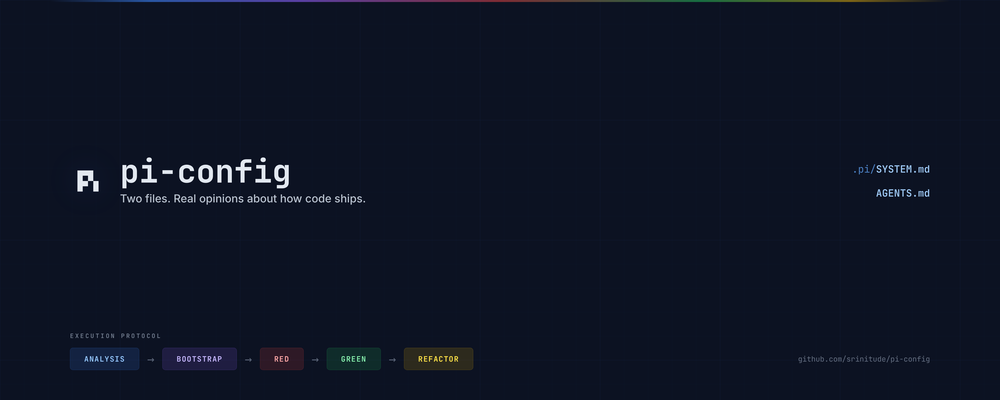

# pi-config

A minimal **Pi project template** for teams that want two things at the same time:

1. a strong opinion about how the agent should behave
2. strict parity with how Pi actually works

This template is intentionally small. It centers on two files:

- `.pi/SYSTEM.md`
- `AGENTS.md`

Use it when you want a repo to start with a custom Pi system prompt and a repo-local operating contract, without inventing workflows or lifecycle behavior that Pi does not actually have.



## Why this template exists

Pi is designed to be **aggressively extensible** so it does not have to dictate your workflow. The core stays small, and you build what you need with:
- extensions
- skills
- prompt templates
- packages
- plain files and scripts

This template applies that same philosophy to project setup:
- keep the core prompt small but explicit
- separate runtime behavior from repo policy
- prefer inspectable text files over hidden magic
- keep the prompt aligned with real Pi docs and source behavior

## Mario’s philosophy reflected here

This template is built around the philosophy encoded in `.pi/SYSTEM.md` and consistent with Pi’s own README/docs:

### 1. The harness serves the developer

Pi should not hijack your workflow.

That means the agent should:
- preserve developer agency over context
- be explicit about what it read, changed, validated, assumed, and does not know
- avoid pretending hidden context, tests, or guarantees exist when they have not been verified

### 2. Keep the core minimal; extend at the edges

Pi’s core philosophy is not “ship every opinionated workflow feature in the box.” It is closer to:
- build less into the core
- make the system extensible
- let developers shape the workflow with extensions and files

That is why Pi intentionally does **not** force certain built-ins into the core. The Pi README explicitly frames the tool around things like:
- no MCP in the core
- no sub-agents in the core
- no permission popups in the core
- no plan mode in the core
- no built-in to-dos in the core
- no background bash in the core

The point is not “never do these things.” The point is: build them in ways that fit your environment, rather than hard-coding one universal workflow into Pi itself.

### 3. Prefer simple, inspectable, reversible systems

This template assumes good agentic systems should be:
- minimal
- understandable
- deterministic where possible
- easy to inspect
- easy to change
- hard to misread

That is why the main configuration is just text files in the repo root.

### 4. Agentic coding is high-leverage and high-risk

The template treats autonomous code changes as powerful but dangerous.

So it pushes the agent toward:
- tight scope
- small changes
- explicit validation
- low blast radius
- reversible edits
- clear reporting

### 5. Writing code should optimize for human comprehension

The writing stance encoded here is not “generate as much code as possible.”
It is:
- build less
- build clearly
- build observably
- build correctly
- optimize for maintainability and reviewability

The template prefers:
- explicit phases
- deterministic validation
- small focused units
- minimal abstractions
- externally supplied dependencies
- honesty about uncertainty

## What each file is responsible for

### `.pi/SYSTEM.md`

This file defines the **agent behavior and Pi runtime model**.

In this template it tells Pi to:
- follow Pi’s real lifecycle and prompt model
- preserve developer agency
- use explicit execution phases:
  - `ANALYSIS`
  - `BOOTSTRAP`
  - `RED`
  - `GREEN`
  - `REFACTOR`
- prefer minimal, inspectable, extensible solutions
- avoid claims about unseen tests, builds, parity, or determinism
- respect actual runtime tool availability
- validate Pi behavior against real docs/examples/source instead of guessing

It also documents Pi-specific facts such as:
- prompt composition order
- input pipeline order
- session/resource hooks
- tool lifecycle hooks
- parallel tool behavior
- mode semantics

### `AGENTS.md`

This file defines the **repo-local operating contract**.

In this template it tells Pi to:
- treat the repo as TDD-first for production code
- establish a minimal automation foundation before production tests or production code
- keep local and GitHub validation aligned
- use one canonical source of gates and failure conditions
- enforce code-structure limits
- optimize for speed without sacrificing determinism or safety

A useful rule of thumb:
- `.pi/SYSTEM.md` = how the agent should think and behave in Pi
- `AGENTS.md` = how work in this repo must be performed

## Parity with how Pi actually works

This is the most important property of the template.

The template is meant to describe **real Pi behavior**, not an imaginary agent lifecycle.

### Prompt composition parity

With a custom `.pi/SYSTEM.md`, Pi builds the effective prompt in this order:
1. `.pi/SYSTEM.md`
2. optional `.pi/APPEND_SYSTEM.md`
3. discovered `AGENTS.md` / `CLAUDE.md` files
4. loaded skills, if any
5. current date
6. current working directory

Important parity note:
- a custom `.pi/SYSTEM.md` replaces Pi’s default textual prompt
- Pi’s default textual `Available tools` section is **not** auto-inserted in that custom-prompt path

### Input pipeline parity

The template is aligned to Pi’s actual input flow:
1. extension commands are checked first
2. `input` handlers run on raw input
3. skill commands and prompt templates expand if input was not handled
4. queueing rules apply while streaming
5. pending `nextTurn` custom messages are injected for the next user prompt
6. `before_agent_start` runs
7. `agent_start` fires
8. the agent loop begins

### Lifecycle parity

The template uses Pi’s real hook names and semantics rather than invented stages.
That includes:
- resource/session hooks such as `resources_discover`, `session_start`, `session_before_switch`, `session_compact`, `model_select`
- agent hooks such as `input`, `before_agent_start`, `agent_start`, `agent_end`, `context`, `before_provider_request`
- tool hooks such as `tool_execution_start`, `tool_call`, `tool_result`, `tool_execution_end`

### Tool behavior parity

The template assumes real Pi tool semantics, including:
- tool calls may run in parallel by default
- sibling tool calls are preflighted sequentially and may execute concurrently
- `tool_call` can mutate inputs or block execution
- `tool_result` can patch results before final emission
- file-mutating custom tools should queue the whole read-modify-write window on the real resolved path

## How this template avoids drift

This template is specifically meant to avoid prompt/docs drift.

### Drift to avoid

Do **not** let the template evolve into a fantasy version of Pi.
Avoid adding README or prompt claims that assume:
- lifecycle stages Pi does not have
- prompt assembly rules Pi does not use
- hidden tools or default prompt sections that are not present
- extension semantics that differ from actual docs/source
- guarantees about tests, builds, parity, caching, or determinism that were not verified

### Practical anti-drift rules

If you change this template, keep these rules:
- update `.pi/SYSTEM.md` only with behavior that matches actual Pi docs/examples/source
- keep `README.md` descriptive of the real configuration, not aspirational marketing
- keep repo policy in `AGENTS.md`, not mixed into runtime semantics unless necessary
- when Pi changes upstream, update the template to match the new reality
- if there is a conflict between documentation and source behavior, resolve it toward source-backed behavior

### Recommended maintenance workflow

When you want to update Pi-specific claims in this template:
1. read the current Pi docs/examples/source
2. update `.pi/SYSTEM.md` first if the behavioral contract changed
3. update `README.md` to explain the new behavior
4. re-run whatever local validation exists in the target repo
5. avoid broad rewrites unless the runtime model actually changed

## Writing-code stance encoded by this template

This template does not just tell Pi what Pi is. It also tells Pi how to work.

The intended writing style is:
- explicit phase reporting
- bootstrap before production TDD
- no production code before a failing production test
- no invented certainty
- minimal correct next step
- smallest relevant deterministic validation after material changes
- preference for human comprehension over autonomous volume

In short: **clear, observable, verified work over impressive-looking but unverifiable output**.

## Recommended repo layout

Use this at the root of a repo:

```text
your-project/
├─ .pi/
│  └─ SYSTEM.md
└─ AGENTS.md
```

Optional additions later:

```text
your-project/
├─ .pi/
│  ├─ SYSTEM.md
│  ├─ APPEND_SYSTEM.md
│  └─ extensions/
├─ AGENTS.md
├─ skills/
├─ prompts/
└─ .github/workflows/
```

## Use this template on GitHub

To create your own Pi project from this repo:

1. Open this repository on GitHub.
2. Click **Use this template**.
3. Choose the owner, repo name, and visibility for your new project.
4. Create the new repository from the template.
5. Clone your new repository locally.
6. Customize `.pi/SYSTEM.md` and `AGENTS.md` for your project.
7. Start Pi from the new repo root and run:

```text
/reload
```

If you prefer a direct link, GitHub also supports generating from:

```text
https://github.com/srinitude/pi-config/generate
```

## Copy this config into an existing repo

From the target repo root, copy in:
- `.pi/SYSTEM.md`
- `AGENTS.md`

Then start Pi from that repo root and run:

```text
/reload
```

## Quick sanity check inside Pi

After loading the config, run:

```text
/reload
```

Then verify that:
- Pi starts in the repo root you expect
- the startup header shows the expected context files
- the agent follows the declared execution phases
- the agent checks bootstrap status before implementation work
- the agent does not claim tests, build validity, parity, or determinism without verification
- the agent’s behavior matches real Pi semantics rather than an invented workflow

## When to edit which file

Edit `.pi/SYSTEM.md` when you want to change:
- Pi runtime assumptions
- agent behavior policy
- tool usage policy
- lifecycle/hook expectations
- execution protocol
- parity constraints against actual Pi behavior

Edit `AGENTS.md` when you want to change:
- repo-specific operating contract
- TDD/bootstrap rules
- automation and CI/CD policy
- structure constraints
- definition of done

## Notes

- Keep `.pi/SYSTEM.md` focused on Pi behavior and runtime/prompt policy.
- Keep `AGENTS.md` focused on repo policy.
- Keep `README.md` honest and source-backed.
- Avoid duplicating the same rule in multiple places unless necessary.
- If you add `.pi/APPEND_SYSTEM.md`, do it intentionally because it changes prompt meaning between `SYSTEM.md` and appended project context.
- If Pi upstream changes, parity is more important than preserving old wording in this template.
